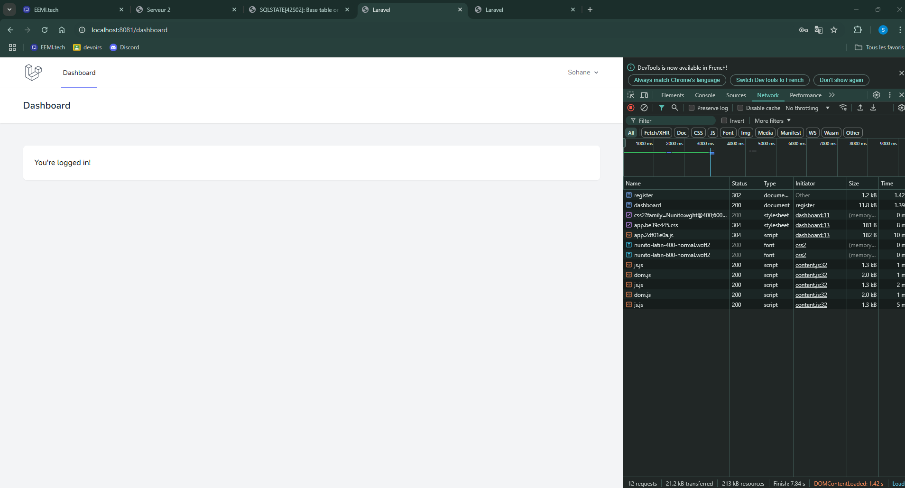

# TP Final 3IW ESGI

Serveur 1
docker exec -it devoir_final-php1-1 bash
cd /var/www/html/TP-Final-3IW-ESGI
composer install --ignore-platform-reqs
php artisan key:generate
php artisan migrate:fresh
Serveur 2
docker exec -it devoir_final-php2-1 bash
cd /var/www/html/TP-Final-3IW-ESGI
composer install --ignore-platform-reqs
php artisan key:generate
php artisan migrate:fresh

4. Accéder aux applications
- Serveur 1 : http://localhost:8081
- Serveur 2 : http://localhost:8082

